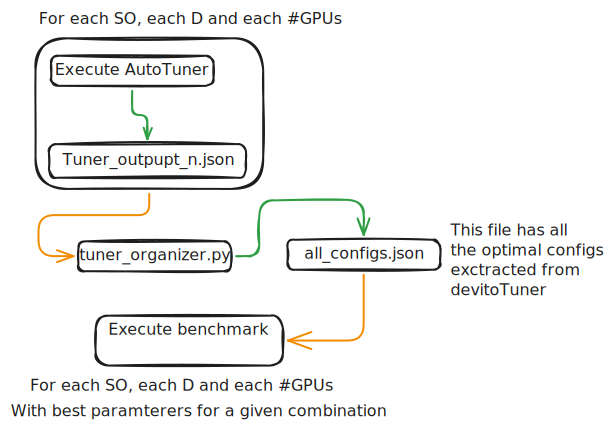

# This is the repository to execute the benchmarks and tuning for the paper "multi GPU"


The goal of this routine is:
- For each machine: Download the devito repository
- Modify the utils.py so that the acquisition has a single receptor
- Execute an array of parameters using the open version of devito
- Tune the same array of parameters using devitoPRO
- execute the benchmark using the tuned parameters
- extract the runtimes (and possible other metrics)

the file ´´´tuned_params.json´´´ has all the tuned parameters, per machine per run configuration (SO, domain size, and GPU number)




## Nomenclature

The file and naming formatting for the tuning `.json` output will always be:

`<machine>\<GPUmodel>_so_<so>_d_<domain_size/shape>_gpu_<gpucount>.json`

example:

`dgx_h200/h200_so_2_d_256_gpu_1.json`

## Example of execution routine with devitoTuner:


1. Submit the job the number of GPU's that you want:

```bash
bash submitter.sh dgx/TunerH200.sh 1
bash submitter.sh dgx/TunerH200.sh 2
bash submitter.sh dgx/TunerH200.sh 4
```

There will be lots of outputs on the `dgx` folder.

2. Join them in a single config file with

```bash
python3 tuner_organizer.py dgx/
```

This will go through all the `.json` files that the autotuner made and get all the best options, and put them into the `all_configs.json` file.

3. Execute the benchmarks with
```bash
bash submitter.sh dgx/ProH200.sh 1
bash submitter.sh dgx/ProH200.sh 2
bash submitter.sh dgx/ProH200.sh 4
```
, that has an extra part to retrieve the optimization options from the `all_configs.json`, (the `get_best_opt` function).

## Notes

The `submitter.sh` is a workaround to ensure that there is no resource hogging when submitting multi-GPU jobs, while maintaining flexibility inside the script.


